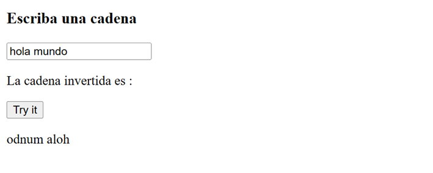
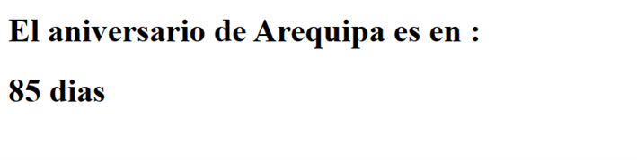
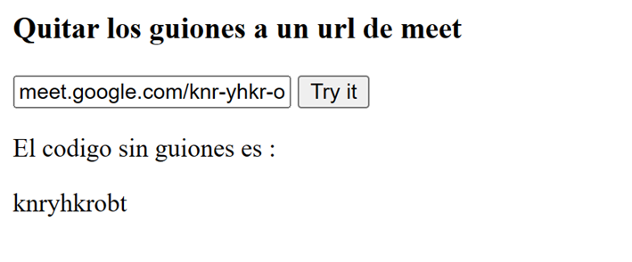
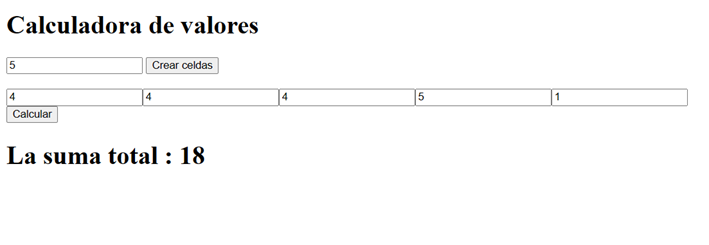
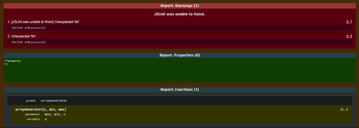

# Laboratorio_02_PWEB2
<table>
    <theader>
        <tr>
            <td></td>
            <th align="center">
                UNIVERSIDAD NACIONAL DE SAN AGUSTIN 
                FACULTAD DE INGENIERÍA DE PRODUCCIÓN Y SERVICIOS 
                ESCUELA PROFESIONAL DE INGENIERÍA DE SISTEMAS
            </th>
            <td></td>
        </tr>
    </theader>
    <tbody>
        <tr><td colspan="3">Formato: Guía de Práctica de Laboratorio</td></tr>
        <tr><td>Aprobación:  2023/03/01</td><td>Código: GUIA-PRLD-001</td><td>Página: 1</td></tr>
    </tbody>
</table>

    <h2>INFORME DE LABORATORIO</h2>

<table>
<theader>
    <tr><th colspan="6" style="width:50%; height:auto; text-align:center">INFORMACIÓN BÁSICA</th></tr>
</theader>
<tbody>
    <tr>
        <td>ASIGNATURA:</td><td colspan="5">Laboratorio de Programación Web 2 - Grupo "D"</td>
    </tr>
    <tr>
        <td>TÍTULO DE LA PRÁCTICA:</td><td colspan="5">Javascript</td>
    </tr>
    <tr>
        <td>NÚMERO DE PRÁCTICA:</td><td>02</td><td>AÑO LECTIVO:</td><td>2023 A</td><td>NRO. SEMESTRE:</td><td>III</td>
    </tr>
    <tr>
        <td colspan="2">FECHA DE PRESENTACIÓN:</td><td>07-May-2023</td><td colspan="2">HORA DE PRESENTACIÓN:</td><td>23:00</td>
    </tr>
    <tr>
        <td colspan="3">INTEGRANTES:
        <ol>
        <li>Carrasco Choque Arles Melvin</li>
        </ol>
        </td>
        <td colspan="2"> NOTA:</td>
        <td>     </td>
    </tr>
    <tr>
        <td colspan="6">DOCENTE: 
        Mg. ANIBAL SARDON
        </td>
    </tr>
</tdbody>
</table>

<table>
    <theader>
        <tr>
            <th style="text-align:center">SOLUCIÓN </th>
        </tr>
    </theader>
    <tbody>
        <tr>
            <td>
            I. SOLUCIÓN DE EJERCICIOS/PROBLEMAS 
                    Link del repositorio 
                    <a href="https://github.com/carrascoArles/Lab02-Pweb2.git">https://github.com/carrascoArles/Lab02-Pweb2.git</a>
            <ul>
                <li>
                    Ejercicio 01: 
                    Escriba una función que reciba el número de día de la fecha actual new Date() - https://www.w3schools.com/jsref/jsref_obj_date.asp y devuelva el texto del día de la semana correspondientes. Por ejemplo si recibe 0, devolvería “Domingo”. 
                    
                </li>
                <li>
                    Ejercicio 02: 
                    Escriba una página web que reciba un texto y al presionar un botón muestre el mismo texto invertido en otra sección (div). Por ejemplo si se escribe “Hola”, se mostraría como “aloH”. 
                    
                </li>
                <li>
                    Ejercicio 03: 
                    Escribir una página que muestre cuántos días faltan para el día de Arequipa! 
                    
                </li>
                <li>
                    Ejercicio 04: 
                    Escribir un página que reciba el URL de la sesión de google meet de hoy y devuelva el código de la sesión sin guiones separadores 
                    
                </li>
                <li>
                    Ejercicio 05: 
                    Escribir una página que permita calcular las suma de todos los valores de una tabla de valores dinámica. La idea es crear una página web con un formulario que te permita decir cuantos valores tendrá la tabla, luego, al enviar el formulario la tabla se debe crear dinámicamente, junto con otro botón de envió para calcular la suma. 
                    
                </li>
                <li>
                    Ejercicio 06: 
                    Utilice la herramienta flipgrid - https://info.flipgrid.com/ envie un video en el tema "Presentación y ejemplo de JavaScript" ponga aquí los enlaces de sus envíos.
                    <ul>    
                    </ul>
                </li>
            </ul>
            </td>
        </tr>
        <tr>
            <td>
            II. SOLUCIÓN DEL CUESTIONARIO 
                <ul>
                    <li>
                        <b>Pruebe el código de arrayGenerator() en la página https://jslint.com/</b> 
                        
                        Al correrlo en el JSlint salen 2 errores :  
                        El primero se refiere a el let, osea que crear el valor de x=0 debio haber sido creado antes de usarlo en el for
                        osea cuando empezo la funcion. 
                        Y el otro caso no sabria a que se refiere pero es un Unexpected "for" y posiblemente sea porque recomienda un uso del for each.   
                    </li>
                    <li>
                        <b>Revisar esta discusión en stackoverflow 
                        https://stackoverflow.com/questions/4852017/how-to-initialize-an-arrays-length-in-javascript</b>
                        <ul>
                            <li>¿Cómo se pueden resolver los warnings?</li>
                            Primero no funciona porque el constructor es ambiguo 
                            No necesitamos inicializar el tamaño del array, lo podemos poner en otra variable:
                            <code><pre>var data = [];
                            var length = 5; // user defined length</pre></code> 
                            <li>¿Se puede modificar la solución usando map? ¿Cómo?</li>
                            Si se puede y lo unico que tendriamos que hacer es crear el valor let a = Array.apply(null, Array(n));
                            y seguiriamos los pasos de la prueba 1 de los ejercicios resueltos a diferencia que usariamos el a.map() para guardar las variables 
                        </ul>
                    </li>
                </ul>
            </td>
        </tr>
        <tr>
            <td>
            III. CONCLUSIONES 
            <ul>
                    1.El lenguaje javascript es muy importante por el hecho que nos permite cambiar cosas dentro de la pagina web si necesidad de recargarla, ademas de facilitarnos con la lectura de datos. 
                    2.Las lecturas de datos Input se hacen mas faciles de leer por lo tanto mas facil de manipular como en el ultimo ejercicio que se leyeron los datos de las tablas guardados en 1 clase que los albergo como arreglos por lo que la suma de estos se facilito.
                </ul>
            </td>
        </tr>
    </tbody>
</table>

<table>
    <theader>
        <tr>
            <th style="text-align:center">RETROALIMENTACIÓN GENERAL</th>
        </tr>
    </theader>
    <tbody>
        <tr>
            <td>
            </td>
        </tr>
    </tbody>
</table>

<table>
    <theader>
        <tr>
            <th style="text-align:center">REFERENCIAS Y BIBLIOGRAFÍA</th>
        </tr>
    </theader>
    <tbody>
        <tr>
            <td>
                [1] Javascript tutorial https://www.w3schools.com/javascript/default.asp
                [2] Validador HTML - https://validator.w3.org/ 
            </td>
        </tr>
    </tbody>
</table>
